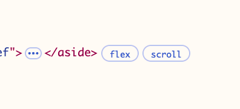
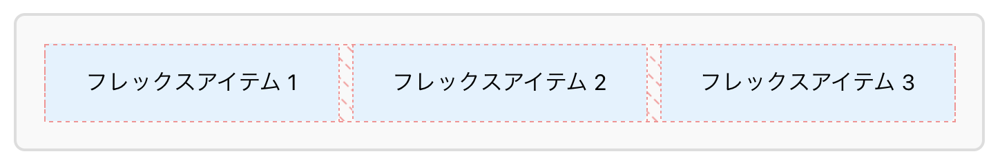
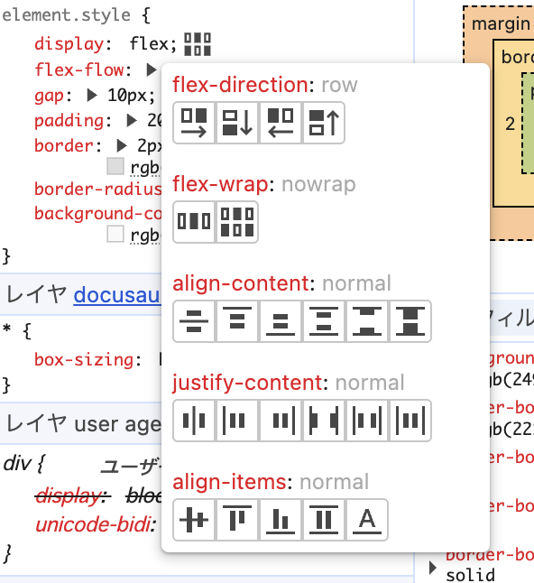

import { FlexContainer } from './components/flex-container';
import { FlexItemFixed } from './components/flex-items-fixed';

# 開発者ツールでのデバッグ

Flexboxレイアウトの問題をデバッグする際、ブラウザの開発者ツールは必須のツールです。
2025年現在、主要ブラウザはすべて専用のFlexboxデバッグ機能を提供しており、
視覚的にレイアウトを理解・修正することが可能です。

## Chrome DevToolsでのFlexboxデバッグ

### Flexboxバッジの活用

ChromeのElements パネルでは、`display: flex` や `display: inline-flex` が適用された要素の横に
**「flex」バッジ**が表示されます。

### 視覚的オーバーレイ機能

ChromeのFlexboxオーバーレイは以下の要素を視覚化します。

- **コンテナの境界**: 点線でフレックスコンテナを表示
- **アイテムの位置**: 各フレックスアイテムの配置
- **フリースペース**: `justify-content` による余白の分布

### Flexboxエディター

Stylesパネルの `display: flex` 宣言の横にあるアイコンをクリックすると、
**Flexboxエディター**が開きます。

